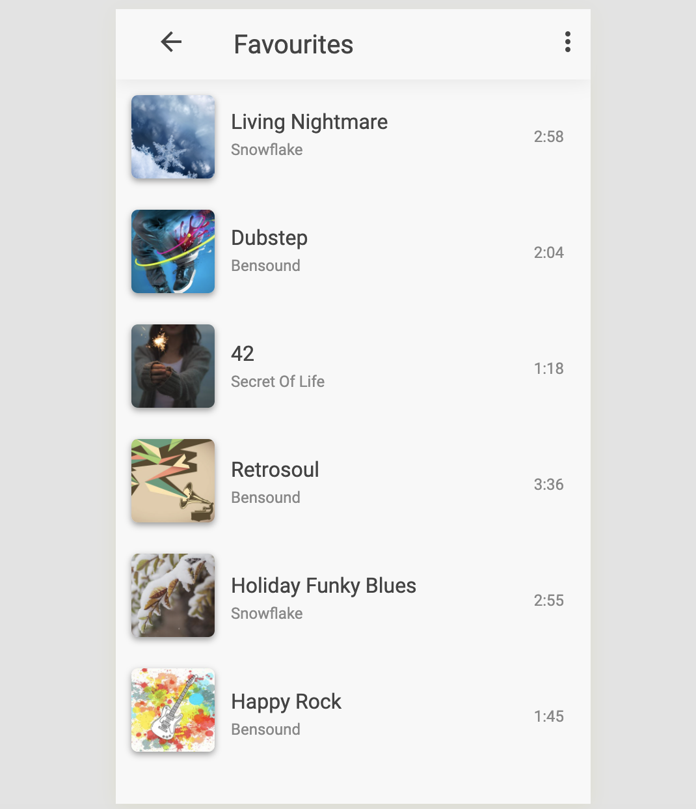
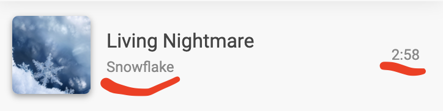

# Buổi 17, thứ 4 06-01-2021

## Bài 1
- Tạo favorite playlist như hình bằng reactjs


- Xem hình ảnh trong thư mục


- Với yêu cầu:
    - Font: 'Roboto', sans-serif
    - Có responsive
    - Text `Favorites` trên header có css
        - ```css
            font-weight: 400;
            font-size: 20px;
          ```
    - Với text sau, thì có css tương ứng: 
        - ```css
            font-size: 12px;
          ```
    - Hãy tự lấy màu và đưa ra được hiển thị đúng như yêu cầu
