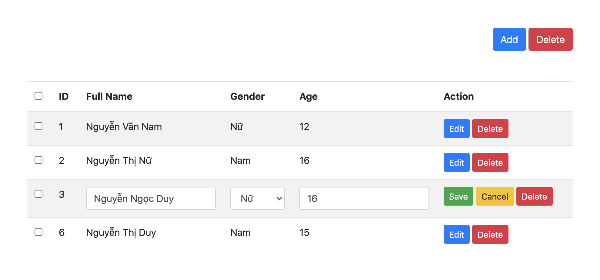

# Bài tập buổi 18, chủ nhật 10-01-2020

## Bài 1
Hãy dùng bootstrap 4 hoặc 5, và reactjs để tạo bảng với yêu cầu:

Có thể `add`, `edit`, và `delete`, `select all`

### Có cấu trúc như sau

Khi nhấn vào nút `edit` sẽ chuyển sang chế độ edit của row chứa nút vừa click
- Dòng có id bằng 3 là 1 dòng đang ở trạng thái edit
- Ở trạng thái edit, nút `edit` bị ẩn đi, thay vào đó là 2 nút: `save` và `cancel`, có thể chỉnh sửa mọi  thông tin ngoại trừ `id`
- Khi nhấn nút `save` thì quay về dạng hiển thị ban đầu với nội dung mới (nội dung vừa chỉnh sửa), ẩn nút `save` và `cancel` đi, hiển thị nút `edit`
- Khi nhấn nút `cancel` thì quay về dạng hiển thị ban đầu với nội dung cũ (nội dung trước khi chỉnh sửa), ẩn nút `save` và `cancel` đi, hiển thị nút `edit`
- Khi nhấn nút `delete` ở 1 dòng nào đó, thì xóa dòng đó khỏi bảng
- Khi nhấn nút `delete` của cả bảng (nút bên góc trên, bên phải của bảng, bên cạnh nút add) thì sẽ phải xóa các dòng đang được `selected`
- Khi nhấn nút `add` thì thêm 1 dòng mới vào cuối bảng ở trạng thái `edit`, trong đó phải tạo `id` sao cho không bao giờ bị trùng `id` với các dòng khác
