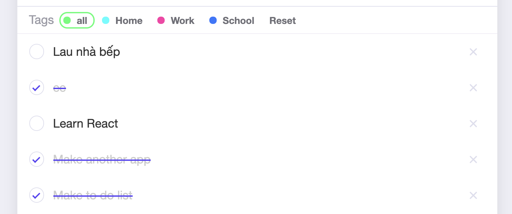

# Bài tập buổi 20, chủ nhật (17-01-2021)

## Bài 1

## Sử dụng reactjs, scss, BEM, không được sử dụng thư viện CSS nào để tạo `todo app` (các công việc cần làm) với các yêu cầu

### Hình mô tả chung

### Trong đó
- `What do you need to do?` là 1 ô input, click vào có thể nhập text và highlight có màu xám như hình

- Khi nhấn vào nút dấu `+` (để thêm mới 1 task vào danh sách bên dưới)
> - Nếu chưa chưa nhập bất cứ thứ gì vào ô input `What do you need to do?` thì alert `Please enter a task` (phải nhập mới thêm được)
> - Nếu đã nhập nội dung vào `What do you need to do?` rồi, và `Tags` hiện tại đang là `all` thì alert: `Please choose a tag` (phải chọn 1 task nào đó không phải là all)

- Phần `Tags`

> - Có các tag cố định là: `Home`, `Work` và `School`
> - `all` và `Reset` không phải là tags

- Khi click vào `all`
> - Hiển thị tất cả các tasks hiện có

- Khi click vào `Home`
> - Hiển thị các tasks ở trong `Home`
> - Tương tự khi click vào `Work` và `School` thì hiển thị các tasks nằm trong tag đó

- Khi click vào `Reset`: Không có gì xảy ra cả

- Đây là hiển thị danh sách các tasks

> - Khi click vào dấu `X` thì xóa task đó khỏi danh sách

- Khi click (`checked`) vào task nào nghĩa là task đó đã hoàn tất (`Completed`), task chưa hoàn tất là task (`Active`)
> - Task đã hoàn tất sẽ có đường gạch ngang
> - Task chưa hoàn tất sẽ hiển thị như bình thường

- Tab chức năng ở bên dưới
> - Có 5 mục: `All tasks`, `Active`, `Completed`, `Clear completed`, `x / y Completed`
>> - `All tasks` show tất cả các tasks (cả active cả completed)
>>> - Nếu tag hiện tại là `Home` thì chỉ show các tasks của `Home`
>> - `Active` chỉ show các tasks ở trạng thái active
>>> - Ví dụ đang ở tag `Home`, và click vào `Active` thì chỉ show các task `Active` của mục `Home`, không show các mục khác
>> - `Completed` chỉ show các task đã hoàn tất
>> - `Clear completed` unmark toàn bộ tasks `Completed` trong mục hiện tại (vd `Home`), chuyển trạng thái thành `Active`
>> - `x / y Completed` số lượng task đã hoàn tất trên tổng số tasks

