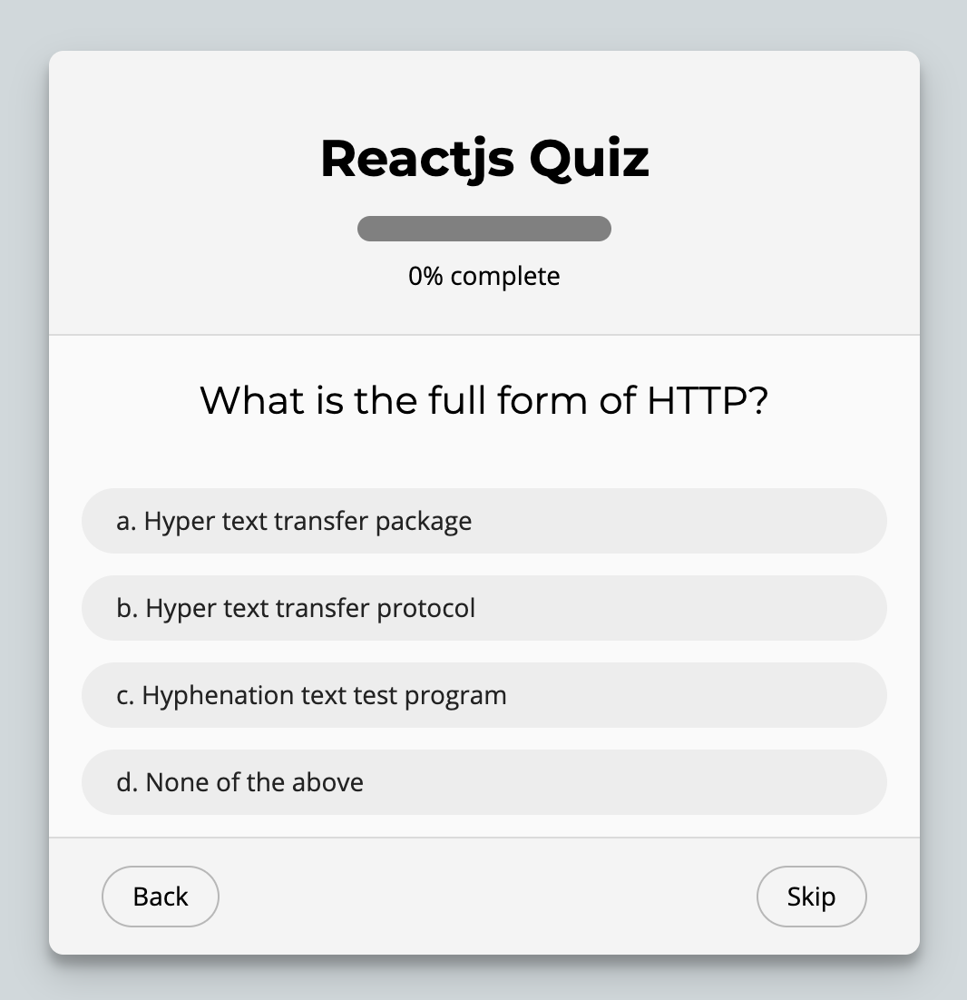

# Bài tập buổi 23, thứ 4 (27-01-2021)


# Practice 01
- Let's create this component bellow


## Note
- This component is a dynamic testing questions
- Let's create an array like code bellow:
    - ```js
        const questions = [
            {
                id: 1,
                question: 'What is the full form of HTTP?',
                answers: [
                    { id: 1, answer: 'Hyper text transfer package' },
                    { id: 2, answer: 'Hyper text transfer protocol' },
                    { id: 3, answer: 'Hyphenation text test program' },
                    { id: 4, answer: 'None of the above' },
                ]
            }
        ]
    ```
- After create an arrray above, you need loop it and show to screen, you can't next to new question if not completed current question
- Let's switch `Skip` button to `Next` button, this is a wrong text
- If you are at lastest question, the right button need to be `Submit`. When you click to `Submit` button, all answers you was mark will be sent to server. Let's use axios and send all payload to `http://localhost:3000/answers`

- Good lucks!